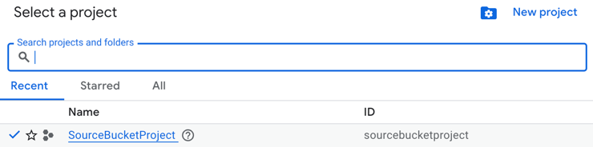
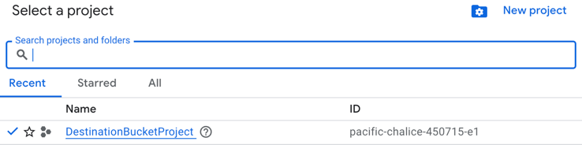
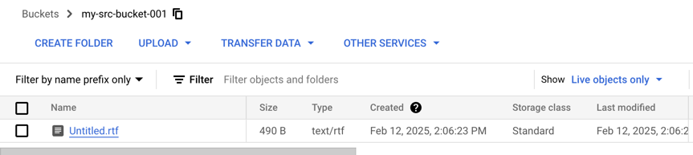
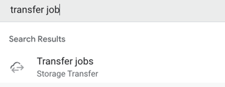
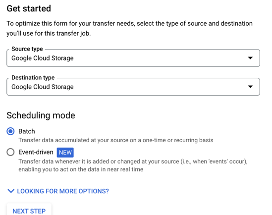
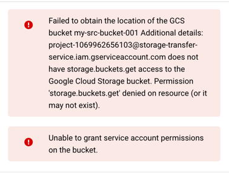
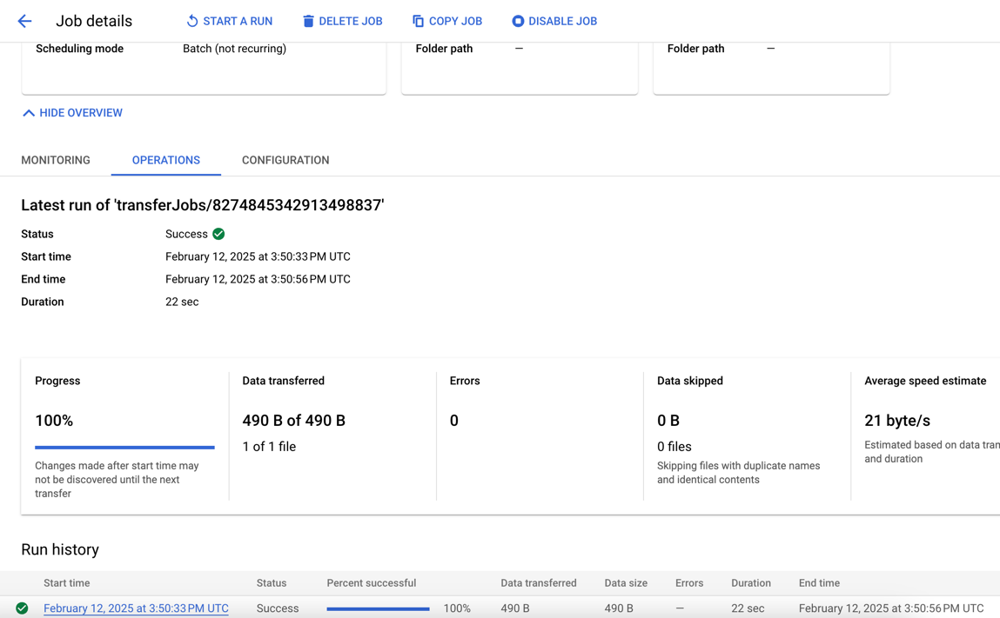
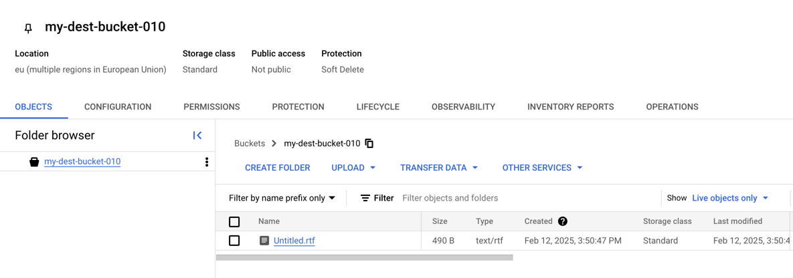

# How to Copy GCP Storage Buckets Between Accounts Without Using the Internet

In this article, we’ll walk you through the process of copying a Google Cloud Platform (GCP) storage bucket and its contents from one GCP account to another, entirely within GCP’s internal network—without relying on the internet. This method is ideal for securely transferring large amounts of data between accounts while maintaining high performance and security.

## Prerequisites

Before we begin, ensure you have the following:

1. **Two GCP Accounts**: You’ll need access to both the source and destination GCP accounts.
2. **Projects in Each Account**:
    - In the source account, create a project named `SourceBucketProject`.
    - In the destination account, create a project named `DestinationBucketProject`.

In account #1 I have a project named `SourceBucketProject`

In the destination project I called it `DestinationBucketProject`

## Step 1: Create a Source Bucket in Account#1

1. Navigate to **Cloud Storage** > **Buckets** in the source account (`SourceBucketProject`).
2. Click **Create** to create a new bucket. Name it `my-src-bucket-001`.
3. Inside the bucket, create a folder named `folder1` and upload a sample file to it.

   

## Step 2: Set Up a Transfer Job in Account #2

1. In the destination account (`DestinationBucketProject`), search for **Transfer Job** in the GCP Console.

   

2. Click **Create Transfer Job**.
3. Set both the source and destination as **Google Cloud Storage**.

   

4. Specify the source bucket as `my-src-bucket-001` and choose or create a destination bucket with a unique name (e.g., `my-dest-bucket-010`).

5. Start the transfer process.

At this point, you may encounter an error related to permissions. This is expected and will be resolved in the next steps.

## Step 3: Grant Necessary Permissions

1. Note the **Principal Service Account** mentioned in the error message. It will look something like this:  
   `project-1069962656103@storage-transfer-service.iam.gserviceaccount.com`.

2. Go back to the source account (`SourceBucketProject`) and navigate to **IAM & Admin** > **Roles**.

3. Create a new custom role named `GsBucketDataTransferRead`. Add the following permissions (which are derived from built-in roles like **Storage Object Admin** and **Storage Legacy Bucket Reader**):
    - `resourcemanager.projects.get`
    - `storage.buckets.get`
    - `storage.folders.get`
    - `storage.folders.list`
    - `storage.managedFolders.get`
    - `storage.managedFolders.list`
    - `storage.multipartUploads.list`
    - `storage.objects.get`
    - `storage.objects.list`

4. Save the custom role.

5. Navigate to **IAM & Admin** > **IAM** and click **Grant Access**.

6. Add the Principal Service Account (noted earlier) and assign it the custom role `GsBucketDataTransferRead`.

## Step 4: Complete the Transfer

1. Return to the destination account (`DestinationBucketProject`) and retry the transfer job.
2. Once the transfer is complete, you’ll see a confirmation message.

   

## Step 5: Verify the Data

1. Navigate to the destination bucket (`my-dest-bucket-010`) and confirm that the file from the source bucket has been successfully transferred.

   

## Conclusion

And that’s it! You’ve successfully copied a GCP storage bucket and its contents from one account to another without using the internet. This method leverages GCP’s internal network for secure and efficient data transfer, making it an excellent choice for enterprise-level data migrations.

We hope this guide has been helpful. If you have any questions or run into issues, feel free to reach out in the comments below!
New chat

